# 16. Sequence Diagrams

Tài liệu này dùng **Mermaid** để mô tả các flow chính.
Nếu viewer không render Mermaid, hãy đọc như pseudo-sequence.

---

## 1. Internal transfer

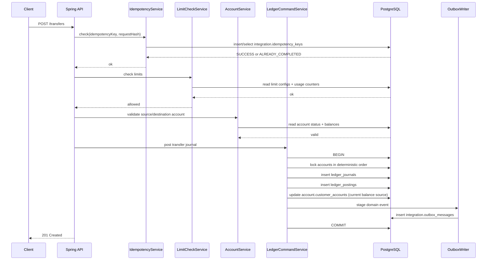

---

## 2. Merchant payment authorize hold

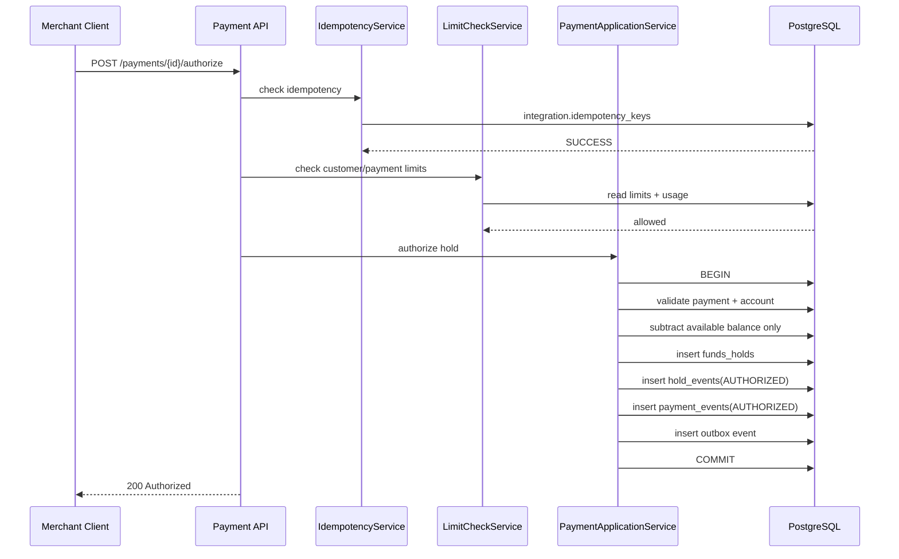

---

## 3. Capture held funds

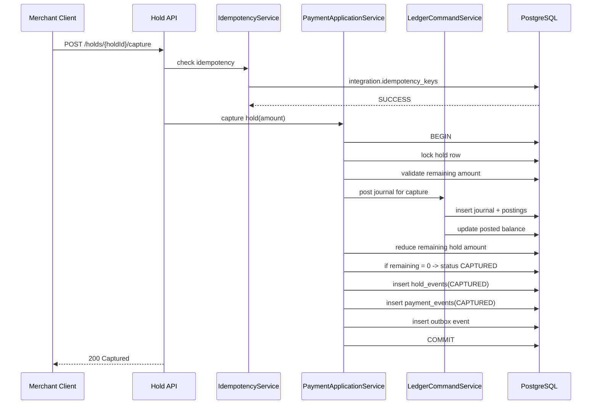

---

## 4. Void hold

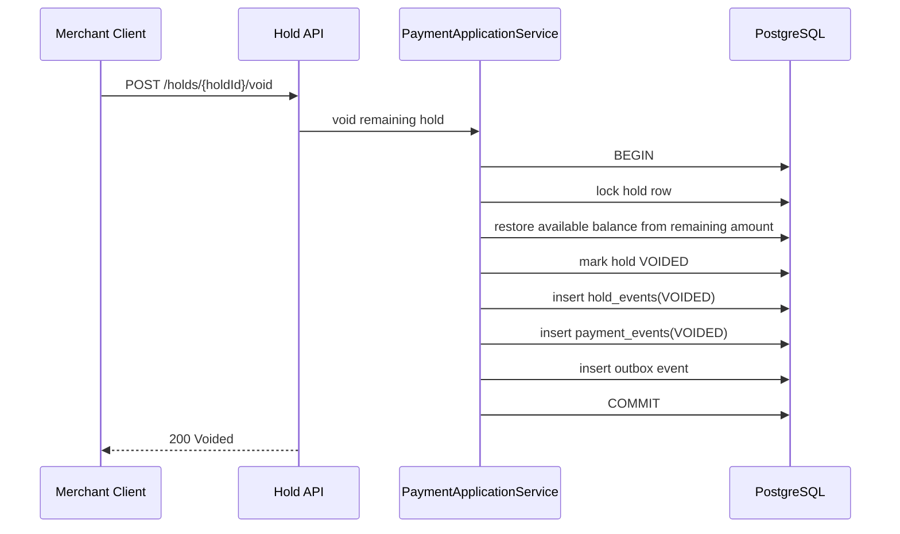

---

## 5. Open term deposit

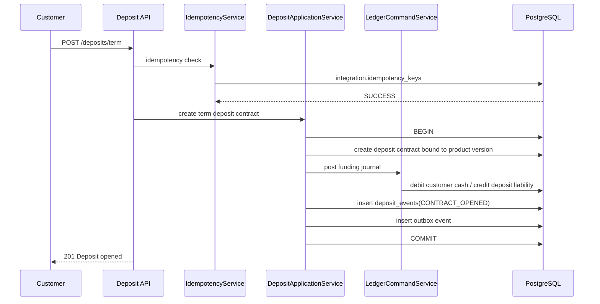

---

## 6. Daily deposit interest accrual batch

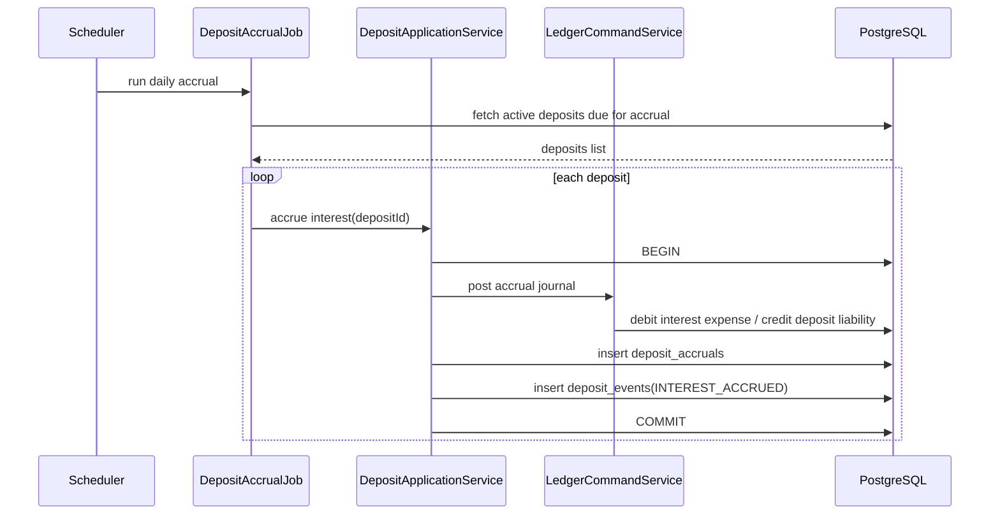

---

## 7. Loan disbursement

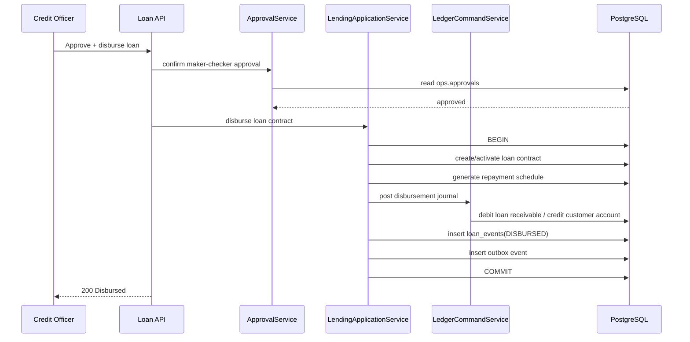

---

## 8. Loan repayment

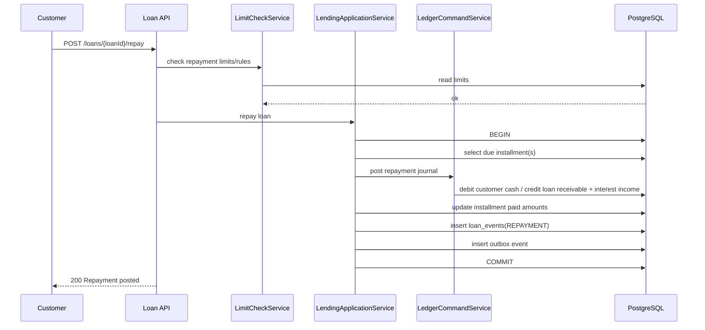

---

## 9. Outbox to Kafka projector

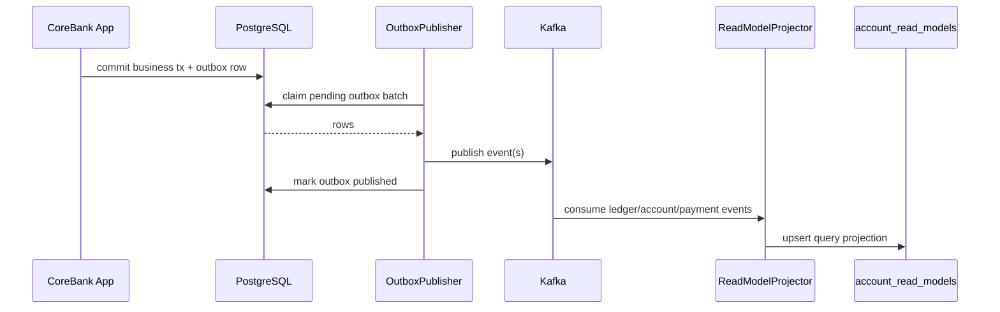

---

## 10. Saga for cross-service orchestration

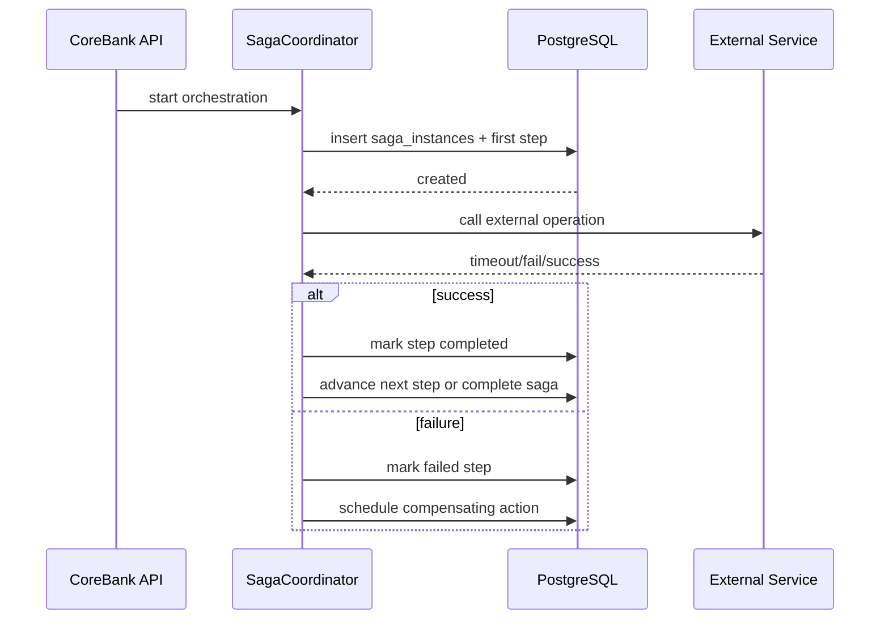

---

## 11. Runtime mode check before write command

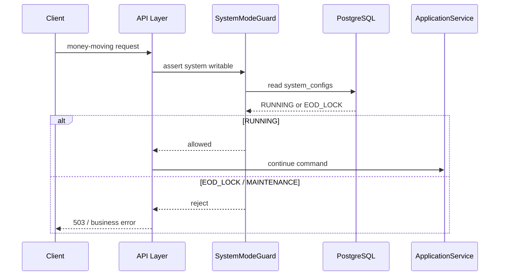

---

## 12. Notes for agents

- Các diagram này mô tả **logical flow**, không bắt buộc 1:1 với class names cụ thể
- Khi code thật, phải luôn giữ nguyên tinh thần:
  - idempotency trước write
  - limits trước money mutation
  - ledger là truth
  - outbox trong cùng DB transaction
  - read model chỉ update sau commit
