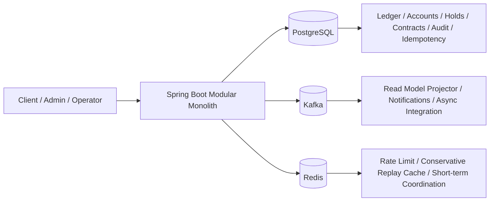

# CoreBank

CoreBank is a production-like fintech/backend portfolio project built as a modular monolith.

The goal is not to clone a full digital bank. The goal is to show that the backend handles money with the right priorities:
- PostgreSQL is the financial source of truth
- double-entry and balance semantics are explicit
- idempotency, outbox, audit, approvals, and reconciliation are built into the design
- Redis and Kafka are useful, but never treated as money truth

## What This Project Demonstrates
- money-moving backend design for transfer, payment, deposit, and lending flows
- strong financial invariants: posted vs available balance, holds, capture, void, reversal-oriented thinking
- production-style safety controls: idempotency, audit trail, outbox, runtime mode guards, approvals, reconciliation
- realistic hardening choices: transient retry, deterministic lock ordering, hot-account baseline, partition readiness, encrypted sensitive data
- clear source-of-truth boundaries between PostgreSQL, Kafka, Redis, and read models

## Architecture At A Glance

## Core Source-Of-Truth Decisions
- PostgreSQL holds financial truth, ledger truth, approval truth, and idempotency truth.
- Kafka is transport for async integration and projection, not the source of truth.
- Redis is acceleration only. In this repo it is used for rate limiting and conservative success replay caching.
- Read models are query truth only. They are not used to authorize money movement.

See:
- [14-source-of-truth-map.md](D:/corebank-api/14-source-of-truth-map.md)
- [19-runtime-failure-modes.md](D:/corebank-api/19-runtime-failure-modes.md)
- [20-acceptance-criteria.md](D:/corebank-api/20-acceptance-criteria.md)

## Current Capability Snapshot
Implemented in the repo today:
- internal transfer flow with idempotency and concurrency safety
- payment hold, capture, and void semantics
- term deposit open, accrual, and maturity flows
- lending disbursement, repayment, overdue, and default transitions
- approval and operator-control foundation
- outbox pattern, dead-letter requeue ops, read-model projection, and saga baseline
- reconciliation runtime baseline and ops observability baseline
- Redis-backed rate limiting and conservative success replay cache while keeping PostgreSQL authoritative

## Four Demo Scenarios
1. Payment hold/capture/void
   Shows posted vs available semantics, hold lifecycle, and idempotent replay safety.
2. Transfer with idempotency and concurrency safety
   Shows deterministic money-write handling under duplicate or concurrent requests.
3. Deposit lifecycle
   Shows product-version-bound contract flow, accrual, maturity, and transient retry hardening.
4. Lending plus overdue/default and outbox recovery narrative
   Shows loan write path, lock-ordering hardening, operator controls, and async reliability story.

Use:
- [28-demo-script.md](D:/corebank-api/28-demo-script.md)
- [16-sequence-diagrams.md](D:/corebank-api/16-sequence-diagrams.md)

## Why It Looks Production-Like
- The design is finance-first, not CRUD-first.
- Money correctness is protected by data ownership rules, not by cache optimism.
- Runtime hardening was added in small slices with tests and evidence in `PROGRESS.log`.
- Infra choices support the domain instead of replacing the domain.
- The project stops before low-ROI polish turns into interview noise.

## Intentional Stop Line
This repo intentionally stops after Phase 5.18.

That is the right portfolio boundary because the project already proves:
- I can model real money flows
- I can add production-style controls without making Redis or projections authoritative
- I can explain tradeoffs clearly

What I intentionally did not keep expanding:
- extra Redis use cases with low interview ROI
- more ops UX polish that adds little new insight
- infrastructure work that is harder to explain than it is valuable

## Recommended Reading Order
1. [01-project-overview.md](D:/corebank-api/01-project-overview.md)
2. [04-system-architecture.md](D:/corebank-api/04-system-architecture.md)
3. [07-financial-invariants.md](D:/corebank-api/07-financial-invariants.md)
4. [14-source-of-truth-map.md](D:/corebank-api/14-source-of-truth-map.md)
5. [16-sequence-diagrams.md](D:/corebank-api/16-sequence-diagrams.md)
6. [18-testing-strategy.md](D:/corebank-api/18-testing-strategy.md)
7. [19-runtime-failure-modes.md](D:/corebank-api/19-runtime-failure-modes.md)
8. [20-acceptance-criteria.md](D:/corebank-api/20-acceptance-criteria.md)
9. [28-demo-script.md](D:/corebank-api/28-demo-script.md)
10. [29-interview-prep.md](D:/corebank-api/29-interview-prep.md)

## Internal Repo-Operating Docs
The AI/Cline operating docs are still in the repo, but they are secondary to the interview narrative:
- [AGENTS.md](D:/corebank-api/AGENTS.md)
- [21-cline-operating-model.md](D:/corebank-api/21-cline-operating-model.md)
- [22-cline-policy-kit.md](D:/corebank-api/22-cline-policy-kit.md)
- [23-cline-workflows.md](D:/corebank-api/23-cline-workflows.md)
- [24-cline-prompts-and-task-templates.md](D:/corebank-api/24-cline-prompts-and-task-templates.md)
- [25-cline-model-strategy.md](D:/corebank-api/25-cline-model-strategy.md)
- [26-cline-troubleshooting.md](D:/corebank-api/26-cline-troubleshooting.md)
