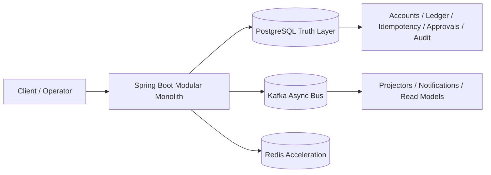

# CoreBank

## What This Is
CoreBank is a production-like fintech backend portfolio project built as a modular monolith.

It is intentionally focused on one goal: prove money correctness and operational control in a realistic backend, without pretending to be a full digital bank platform.

## Production-Like Signals
- Explicit posted vs available balance semantics across payment, transfer, deposit, and lending flows.
- PostgreSQL-led correctness model for ledger/account/idempotency/approval state.
- Idempotency, audit trail, outbox, approvals, runtime-mode guards, and reconciliation included as first-class controls.
- Bounded transient retry and deterministic lock-order hardening on contention-prone money paths.
- Dead-letter handling and ops/reporting endpoints for operational recovery workflows.
- Redis used selectively for performance/coordination, not as financial truth.

## Source-of-Truth Decisions
- PostgreSQL is authoritative for money state, idempotency truth, and approval truth.
- Kafka is async transport/projection plumbing, not the source of truth.
- Redis is non-authoritative acceleration (rate limit + conservative success replay cache).
- Read models are query convenience only; they never authorize money movement.

References:
- [14-source-of-truth-map.md](14-source-of-truth-map.md)
- [19-runtime-failure-modes.md](19-runtime-failure-modes.md)
- [20-acceptance-criteria.md](20-acceptance-criteria.md)

## Core Capabilities
- Payments: hold, capture, void with idempotent behavior.
- Transfers: concurrency-safe and idempotent internal transfer flow.
- Deposits: open, accrue, maturity lifecycle.
- Lending: disburse, repay, overdue, default transitions.
- Ops controls: approvals, runtime mode guards, reconciliation, outbox dead-letter operations.
- Reliability layers: outbox pattern, saga/read-model baseline, targeted hardening on transient failures.

## How To Demo In 10 Minutes
- Live browser demo: run app and open [`/dashboard/`](http://localhost:8080/dashboard/)
- Demo credentials:
  - `demo_user / demo_user`
  - `demo_ops / demo_ops`
  - `demo_admin / demo_admin`
- Use the fixed walkthrough: [28-demo-script.md](28-demo-script.md)
- Use interview talking structure: [29-interview-prep.md](29-interview-prep.md)
- Regenerate evidence pack: [30-showcase-runner.md](30-showcase-runner.md)

Run:

```powershell
mvn spring-boot:run
# then open http://localhost:8080/dashboard/
```

```powershell
.\30-showcase-runner.ps1
```

## Quick Credibility Evidence
- [28-demo-script.md](28-demo-script.md)
- [29-interview-prep.md](29-interview-prep.md)
- [30-showcase-runner.md](30-showcase-runner.md)
- `showcase-output/latest-showcase-report.md`

## Architecture Snapshot


## Intentional Stop Line
This repo intentionally stops after Phase 5.18 hardening.

Reason:
- The project already demonstrates realistic fintech backend signals for interview evaluation.
- Additional infra-heavy slices from this point have lower explanation ROI than value gained.
- The narrative is now clear and defensible: PostgreSQL truth first, Redis/Kafka supportive only.

## Doc Map
1. [01-project-overview.md](01-project-overview.md)
2. [04-system-architecture.md](04-system-architecture.md)
3. [07-financial-invariants.md](07-financial-invariants.md)
4. [14-source-of-truth-map.md](14-source-of-truth-map.md)
5. [16-sequence-diagrams.md](16-sequence-diagrams.md)
6. [18-testing-strategy.md](18-testing-strategy.md)
7. [19-runtime-failure-modes.md](19-runtime-failure-modes.md)
8. [20-acceptance-criteria.md](20-acceptance-criteria.md)
9. [28-demo-script.md](28-demo-script.md)
10. [29-interview-prep.md](29-interview-prep.md)

## Secondary Internal Docs
Internal AI/Cline operating docs are kept for workspace operations and are secondary to the interview narrative:
- [AGENTS.md](AGENTS.md)
- [21-cline-operating-model.md](21-cline-operating-model.md)
- [22-cline-policy-kit.md](22-cline-policy-kit.md)
- [23-cline-workflows.md](23-cline-workflows.md)
- [24-cline-prompts-and-task-templates.md](24-cline-prompts-and-task-templates.md)
- [25-cline-model-strategy.md](25-cline-model-strategy.md)
- [26-cline-troubleshooting.md](26-cline-troubleshooting.md)
