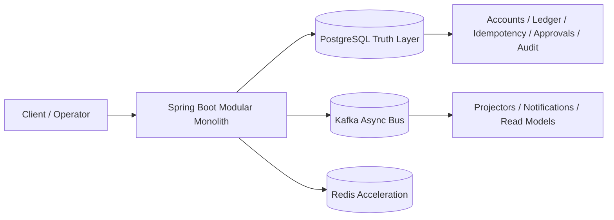

# CoreBank API

**Production-signal fintech backend portfolio — PostgreSQL truth, money correctness, and operational control in a deployable modular monolith.**

[](#live-demo) &nbsp; [](#) &nbsp; [](#) &nbsp; [](#)

> **Why this exists:** Prove that a backend engineer can design, implement, and deploy a realistic fintech system with correct money semantics — not just wire up a CRUD API.

---

## Live Demo

**[corebank-api.onrender.com](https://corebank-api.onrender.com)** — open the dashboard and run a guided demo in 3 minutes.

*Demo runs on Render free tier. First request may take 30-60 seconds to wake up. PostgreSQL data resets after 90 days (free tier limit). Kafka and Redis are disabled in public showcase — the app runs on PostgreSQL alone.*

## Demo Credentials

| Role | Username | Password |
|------|----------|----------|
| Admin | `demo_admin` | `demo_admin` |
| Operator | `demo_ops` | `demo_ops` |
| User | `demo_user` | `demo_user` |

## 3-Minute Walkthrough

1. Open the [live dashboard](https://corebank-api.onrender.com/dashboard/)
2. Login as `demo_admin` / `demo_admin`
3. Click **Initialize Demo Data** (idempotent — safe to run repeatedly)
4. Run **Authorize Hold** → funds reserved, double-entry posted
5. Run **Capture Hold** → payment settled, journal updated
6. Run **Internal Transfer** with an `Idempotency-Key` header
7. Replay the same transfer with the same key → returns the **original** response (exactly-once)
8. Check the **Reconciliation** tab for automated internal/external break detection

For depth: [28-demo-script.md](28-demo-script.md) | [29-interview-prep.md](29-interview-prep.md)

## What This Proves

| Capability | Why It Matters |
|-----------|---------------|
| **Payment hold/capture/void** | Same lifecycle as Stripe/Adyen — authorize, settle, or release funds with full audit trail |
| **Idempotent transfers** | Send the same request twice, get the same result — PostgreSQL idempotency keys, not app memory |
| **Outbox pattern** | Events are written atomically with business data in the same PostgreSQL transaction — no lost messages |
| **Approval governance** | Maker/checker workflows for sensitive operations (loan defaults, dead-letter requeue) |
| **Reconciliation** | Automated internal and external reconciliation with break detection |
| **Rate limiting** | Redis-backed rate limiting on money-mutation endpoints — degrades gracefully without Redis |
| **System mode guards** | Runtime read-only/maintenance modes enforced at the API layer |
| **PostgreSQL truth** | Accounts, ledger, idempotency, approvals, and audit all live in PostgreSQL — never in cache or message queue |

## Architecture


```mermaid
flowchart LR
    Client[Client / Operator] --> API[Spring Boot Modular Monolith]
    API --> PG[(PostgreSQL Truth Layer)]
    API --> Kafka[(Kafka Async Bus)]
    API --> Redis[(Redis Acceleration)]
    PG --> Money[Accounts / Ledger / Idempotency / Approvals / Audit]
    Kafka --> Proj[Projectors / Notifications / Read Models]
```

**Source-of-truth decisions:**
- **PostgreSQL** is authoritative for money state, idempotency, and approvals
- **Kafka** is async transport/projection — not the source of truth
- **Redis** is non-authoritative acceleration (rate limiting + idempotency replay cache)
- **Read models** are query convenience only — never authorize money movement

In public showcase, Kafka and Redis are **optional** — the app runs with PostgreSQL alone. Money operations still write outbox rows to PostgreSQL; only async publishing and projection are paused.

## Run Locally

```powershell
# PostgreSQL only (Kafka and Redis are optional)
docker compose up -d postgres
./mvnw spring-boot:run
# open http://localhost:9090/
```

```powershell
# Full stack with showcase runner
docker compose up -d postgres redis
./mvnw spring-boot:run -Dspring-boot.run.profiles=showcase
.\30-showcase-runner.ps1
```

## Deploy (Render)

See [DEPLOY.md](DEPLOY.md) for step-by-step instructions. One-click deploy via `render.yaml` blueprint.

Key env vars:
- `SPRING_PROFILES_ACTIVE=showcase`
- `SPRING_DATASOURCE_URL=<JDBC URL>` (convert from Render's `postgres://` format)
- `COREBANK_KAFKA_ENABLED=false`

---

## Technical Deep Dive

<details>
<summary>Click to expand — full technical documentation</summary>

### What This Is
CoreBank is a production-like fintech backend portfolio project built as a modular monolith.

It is intentionally focused on one goal: prove money correctness and operational control in a realistic backend, without pretending to be a full digital bank platform.

### Production-Like Signals
- Explicit posted vs available balance semantics across payment, transfer, deposit, and lending flows.
- PostgreSQL-led correctness model for ledger/account/idempotency/approval state.
- Idempotency, audit trail, outbox, approvals, runtime-mode guards, and reconciliation included as first-class controls.
- Bounded transient retry and deterministic lock-order hardening on contention-prone money paths.
- Dead-letter handling and ops/reporting endpoints for operational recovery workflows.
- Redis used selectively for performance/coordination, not as financial truth.

### Core Capabilities
- Payments: hold, capture, void with idempotent behavior.
- Transfers: concurrency-safe and idempotent internal transfer flow.
- Deposits: open, accrue, maturity lifecycle.
- Lending: disburse, repay, overdue, default transitions.
- Ops controls: approvals, runtime mode guards, reconciliation, outbox dead-letter operations.
- Reliability layers: outbox pattern, saga/read-model baseline, targeted hardening on transient failures.

### Quick Credibility Evidence
- [28-demo-script.md](28-demo-script.md)
- [29-interview-prep.md](29-interview-prep.md)
- [30-showcase-runner.md](30-showcase-runner.md)
- `showcase-output/latest-showcase-report.md`

### Intentional Stop Line
This repo intentionally stops after Phase 6.0 showcase hardening.

Reason:
- The project already demonstrates realistic fintech backend signals for interview evaluation.
- Additional infra-heavy slices from this point have lower explanation ROI than value gained.
- The narrative is now clear and defensible: PostgreSQL truth first, Redis/Kafka supportive only.

### Doc Map
1. [01-project-overview.md](01-project-overview.md)
2. [04-system-architecture.md](04-system-architecture.md)
3. [07-financial-invariants.md](07-financial-invariants.md)
4. [14-source-of-truth-map.md](14-source-of-truth-map.md)
5. [16-sequence-diagrams.md](16-sequence-diagrams.md)
6. [18-testing-strategy.md](18-testing-strategy.md)
7. [19-runtime-failure-modes.md](19-runtime-failure-modes.md)
8. [20-acceptance-criteria.md](20-acceptance-criteria.md)
9. [28-demo-script.md](28-demo-script.md)
10. [29-interview-prep.md](29-interview-prep.md)

### Secondary Internal Docs
Internal AI/Cline operating docs are kept for workspace operations and are secondary to the interview narrative:
- [AGENTS.md](AGENTS.md)
- [21-cline-operating-model.md](21-cline-operating-model.md)
- [22-cline-policy-kit.md](22-cline-policy-kit.md)
- [23-cline-workflows.md](23-cline-workflows.md)
- [24-cline-prompts-and-task-templates.md](24-cline-prompts-and-task-templates.md)
- [25-cline-model-strategy.md](25-cline-model-strategy.md)
- [26-cline-troubleshooting.md](26-cline-troubleshooting.md)

</details>
