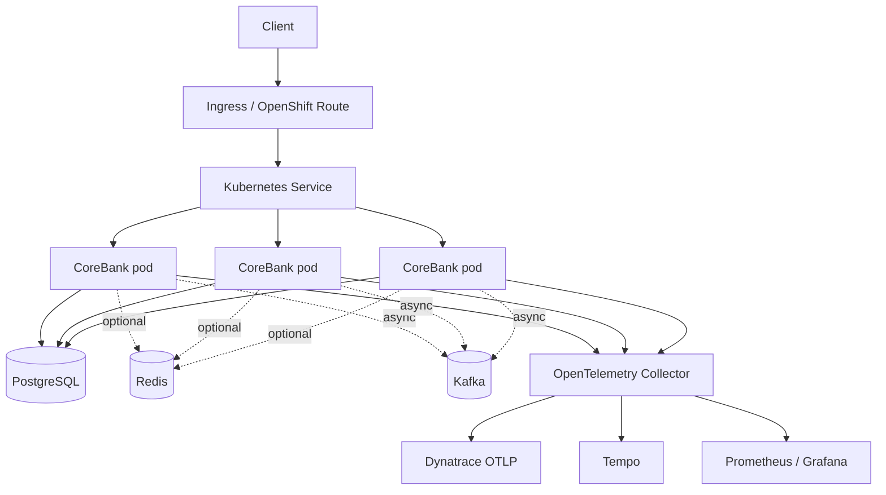

# CoreBank

**A core-banking workload built for financial correctness under failure — then packaged,
observed and operated like a platform workload.**

[](https://github.com/MaiHuyHoang592004/corebank-api/actions/workflows/ci.yml)

**Application:** Java 17 · Spring Boot · PostgreSQL · Redis · Kafka  
**Platform:** Docker · Kubernetes · OpenShift overlay · Kustomize · GitHub Actions  
**Observability:** Micrometer · OpenTelemetry · Prometheus · Tempo · Grafana · Dynatrace OTLP path  
**Operations:** probes · rolling updates · HPA/PDB · SLOs · alerts · incident runbooks

[Live demo](https://corebank-api-acv7.onrender.com) ·
[Failure evidence](docs/19-runtime-failure-modes.md) ·
[Operations runbook](docs/31-operations-runbook.md) ·
[Platform & APM guide](docs/33-platform-deployment-and-apm-guide.md)

---

## Why this system exists

The project is built around one question:

> **When this system fails, what happens to the money?**

A successful HTTP response says very little about whether a banking system is safe.
The interesting cases are the ones where the application cannot give a clean answer:

- the process dies while a transfer is in flight;
- a client retries because it never received the response;
- concurrent requests race for the same balance;
- the broker is unavailable while the ledger is healthy;
- an instance owns an idempotency claim and disappears;
- database connection pressure makes the API unavailable without corrupting money.

CoreBank treats those as design inputs rather than exceptional cases.

PostgreSQL remains authoritative for financial state. Redis and Kafka can improve
availability, throughput or integration behaviour, but neither is allowed to decide
whether money moved.

---

## System shape


```mermaid
flowchart TB
    Client[Client] --> Edge[Ingress / OpenShift Route]
    Edge --> Service[Kubernetes Service]
    Service --> A[CoreBank pod]
    Service --> B[CoreBank pod]
    Service --> C[CoreBank pod]

    A --> PG[(PostgreSQL)]
    B --> PG
    C --> PG

    A -. optional .-> Redis[(Redis)]
    B -. optional .-> Redis
    C -. optional .-> Redis

    A -. async .-> Kafka[(Kafka)]
    B -. async .-> Kafka
    C -. async .-> Kafka

    A --> OTEL[OpenTelemetry Collector]
    B --> OTEL
    C --> OTEL

    OTEL --> Dynatrace[Dynatrace OTLP]
    OTEL --> Tempo[Tempo]
    OTEL --> Prom[Prometheus / Grafana]
```

The application remains a **modular monolith**. Transactional correctness is the hard
problem here; service extraction is deferred until a real scaling, ownership or
deployment boundary justifies the additional distributed-systems cost.

---

## Engineering guarantees

### Financial correctness

- **Double-entry ledger** — every journal must balance before it can be posted.
- **Posted and available balances are different states** — a hold reserves spendable
  money without pretending that settlement already occurred.
- **Idempotent money commands** — retries cannot silently double-post transfers or
  payment operations.
- **Deterministic locking** — affected financial rows are locked in a stable order to
  reduce avoidable deadlock patterns.
- **Transactional outbox** — the event commits with the financial transaction; broker
  availability does not decide whether the money movement is true.
- **Maker/checker and reconciliation controls** — sensitive operations and external
  disagreements have explicit operational paths.

### Failure recovery

- an abandoned idempotency claim carries a lease and can be safely taken over;
- liveness checks the process, not shared infrastructure;
- readiness gates traffic on database availability;
- graceful shutdown allows in-flight money commands to finish before pod termination;
- ledger throughput metrics increment **after transaction commit**, not after an SQL
  insert that may still roll back.

---

## Operational evidence

The repository distinguishes **implemented configuration** from **observed runtime
behaviour**.

| Capability | Evidence | Status |
|---|---|---|
| Financial failure experiments | SIGKILL, retry storm, concurrent duplicates, connection starvation | **Measured** |
| Container build | CI build, Trivy gate, immutable image workflow | **CI-validated** |
| Kubernetes manifests | Deployment, Service, Ingress, HPA, PDB, probes, security context | **CI-validated; live cluster verification pending** |
| OpenShift | Kustomize overlay, Route, arbitrary-UID-compatible application deployment | **CI-validated; live OpenShift verification pending** |
| Application telemetry | HTTP observations, JDBC spans, banking metrics, structured logs | **Implemented** |
| Cluster OTel Collector | Kubernetes manifests and Dynatrace exporter | **CI-validated; runtime verification pending** |
| Dynatrace | OTLP traces/metrics integration path | **Configured; live tenant verification pending** |
| Service Mesh | Canary/mTLS validation design | **Not implemented** |

The detailed verification model is documented in
[Platform Deployment and APM Guide](docs/33-platform-deployment-and-apm-guide.md).

---

## What broke when it was made to fail

These failures were induced against a running PostgreSQL-backed application. They are
kept separate from Kubernetes self-healing exercises: deleting a pod proves Kubernetes
reconciliation; it does not prove the application preserves financial invariants.

| Failure | Observed result | Change that followed |
|---|---|---|
| `SIGKILL` during 60 concurrent transfers | Uncommitted work rolled back and money stayed correct, but four idempotency claims remained `IN_PROGRESS` forever | Claims now have a takeover lease |
| 14 concurrent requests against a cold instance | 32 seconds, ten `500` responses, exactly one journal | Root cause was connection starvation; pool sizing is now explicit and documented |
| Concurrent duplicates of one command | Exactly one journal, but one caller got `500` | Claim acquisition changed to `ON CONFLICT` rather than reading inside an already-aborted PostgreSQL transaction |
| Running the outbox as deployed | Publisher never executed | Missing scheduling activation was fixed and guarded |
| Anonymous health probes | `401` on liveness/readiness | Probe paths are explicitly accessible to the kubelet |
| Container scan | Eight fixable `CRITICAL` findings | Image publication is gated by scanning and affected dependencies were upgraded |

After each financial scenario the important invariant was checked again: total money
unchanged, balanced journals, no unexpected negative balance. Availability failed in
some scenarios; financial correctness did not.

Full method and measurements:
[Runtime Failure Modes](docs/19-runtime-failure-modes.md).

---

## Platform and deployment

The Kubernetes deployment is intentionally more than a single `Deployment.yaml`.

It includes:

- three application replicas;
- startup, readiness and liveness probes;
- separate application and management ports;
- rolling updates with `maxUnavailable: 0`;
- graceful Spring shutdown plus pod termination grace;
- HPA and PodDisruptionBudget;
- resource requests and limits;
- non-root execution, dropped capabilities and read-only root filesystem;
- pod anti-affinity;
- ConfigMap/Secret separation;
- immutable image selection through Kustomize.

OpenShift reuses the Kubernetes base and changes only platform-specific concerns through
an overlay: the nginx Ingress is replaced by an OpenShift `Route`, the environment
identity changes, and PostgreSQL is expected to be provided by an OpenShift-compatible
or external deployment.

The application does not require a fixed runtime UID, which keeps the workload aligned
with OpenShift's restricted security model instead of weakening the platform policy to
fit the image.

Deployment detail:
[deploy/kubernetes/README.md](deploy/kubernetes/README.md) ·
[Platform Deployment and APM Guide](docs/33-platform-deployment-and-apm-guide.md).

---

## Observability and APM

CoreBank is instrumented around questions an operator can act on.

### Traces

A transfer trace can contain:

```text
HTTP /api/transfers/internal
        │
        ▼
JDBC CONNECTION
        │
        ▼
JDBC QUERY
        │
        ▼
PostgreSQL
```

`CONNECTION` spans matter because one measured outage was connection-pool starvation,
not slow SQL. Without connection-acquisition timing, that failure appears only as
unexplained request latency.

JDBC bind values are deliberately excluded from telemetry so account identifiers,
customer references and monetary values are not copied into an APM backend.

### Release correlation

Telemetry carries `service.version` from the application build. A latency regression can
therefore be investigated against the release that emitted it instead of treating every
deployment as the same service.

### Banking signals

The service exports operational signals that HTTP status alone cannot answer, including:

- pending and dead-letter outbox events;
- open reconciliation breaks;
- in-flight and stale idempotency claims;
- total ledger size;
- committed-journal throughput.

Alerts link to written response procedures in the
[Operations Runbook](docs/31-operations-runbook.md).

### Vendor-neutral telemetry

Application code exports OpenTelemetry rather than a vendor-specific SDK.

Locally:

```text
CoreBank → OTel Collector → Tempo / Prometheus → Grafana
```

For managed APM:

```text
CoreBank → OTel Collector → Dynatrace OTLP
```

The cluster Collector already contains the Dynatrace OTLP exporter, while live tenant
verification is intentionally tracked as pending rather than presented as completed
experience.

---

## SLO and incident model

The repository defines proposed service-level objectives for the money paths rather than
for every endpoint.

Current design includes:

- **availability:** proposed 99.9% rolling 30-day target;
- **latency:** proposed p95 below 2 seconds for synchronous payment/transfer paths;
- **read-model freshness:** separate freshness objective;
- explicit separation between correct `4xx` refusal and server-side failure;
- alerts classified by customer symptom versus underlying cause.

These are proposed engineering targets, not production statistics. There is no long-lived
production traffic history to justify pretending otherwise.

See [Service Levels](docs/32-service-levels.md).

---

## Run locally

### Application

```bash
docker compose up -d postgres
./mvnw spring-boot:run
```

Open:

```text
http://localhost:9090/
```

Redis and Kafka are optional for the basic startup path. The application is designed so
their absence does not redefine financial truth.

A hosted demo is available at
[corebank-api-acv7.onrender.com](https://corebank-api-acv7.onrender.com) and may take
up to ninety seconds to wake.

Demo credentials:

```text
demo_admin / demo_admin
```

Initialize the demo data, authorize and capture a hold, execute a transfer, then replay
the transfer with the same idempotency key.

Walkthrough: [Demo Walkthrough](docs/28-demo-script.md).

### Local observability stack

```bash
docker compose -f deploy/observability/docker-compose.yml up -d

COREBANK_OTLP_ENABLED=true \
COREBANK_LOG_FORMAT=ecs \
./mvnw spring-boot:run
```

### Kubernetes

```bash
kind create cluster --name corebank --config deploy/kubernetes/kind-cluster.yaml

cp deploy/kubernetes/secret.example.yaml deploy/kubernetes/secret.yaml
# edit the local secret before applying it

kubectl apply -f deploy/kubernetes/namespace.yaml
kubectl apply -f deploy/kubernetes/secret.yaml
kubectl apply -k deploy/kubernetes
```

Runtime verification gates are listed in
[Platform Deployment and APM Guide](docs/33-platform-deployment-and-apm-guide.md).

---

## Verification

```bash
./mvnw verify
./mvnw -Dgroups=fast test
```

Money-path integration tests run against PostgreSQL rather than mocks because row locks,
transaction abort semantics and uniqueness behaviour are part of the feature.

CI performs:

```text
fast checks
    ↓
manifest render + schema validation
    ↓
full Testcontainers verification
    ↓
container build
    ↓
Trivy image scan
    ↓
publish immutable image
```

The image is not published when the gate fails.

---

## Technology

| Area | Choices |
|---|---|
| Application | Java 17, Spring Boot 4 |
| Financial truth | PostgreSQL, Flyway |
| Async / acceleration | Kafka, Redis |
| Verification | JUnit, Testcontainers |
| Packaging | Docker |
| Platform | Kubernetes, Kustomize, OpenShift overlay |
| Observability | Micrometer, OpenTelemetry, Prometheus, Tempo, Grafana |
| Managed APM path | Dynatrace via OTLP |
| Delivery | GitHub Actions, Trivy |

Technology is deliberately downstream of the guarantees. None of these tools is allowed
to become financial truth merely because it is convenient.

---

## Scope and limitations

CoreBank is not a running bank and does not claim production deployment history.

It models the areas where financial correctness is decided and stops before card
schemes, external clearing/settlement networks, KYC providers and a complete
customer-facing banking product.

Also intentionally outside the current implementation:

- production database high availability;
- production secret-management integration;
- centralized log shipping/paging integration;
- live OpenShift verification;
- live Dynatrace tenant verification;
- Service Mesh runtime implementation.

Those boundaries are documented rather than hidden.

---

## Documentation

Start with:

1. [Financial Invariants](docs/07-financial-invariants.md)
2. [Source-of-Truth Map](docs/14-source-of-truth-map.md)
3. [Runtime Failure Modes](docs/19-runtime-failure-modes.md)
4. [Operations Runbook](docs/31-operations-runbook.md)
5. [Service Levels](docs/32-service-levels.md)
6. [Platform Deployment and APM Guide](docs/33-platform-deployment-and-apm-guide.md)

Full index: [docs/README.md](docs/README.md).
