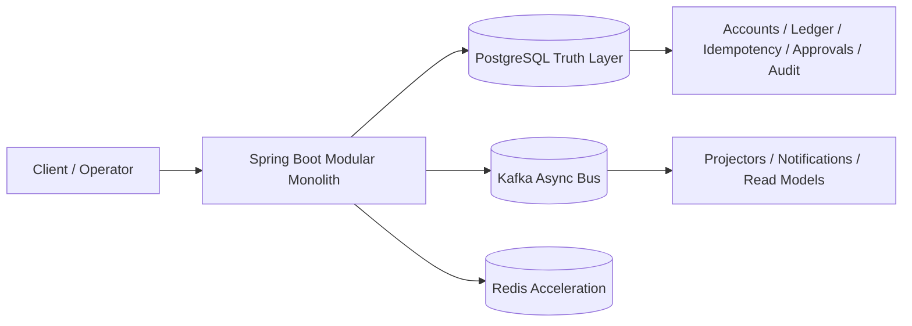

# CoreBank API

**Production-signal fintech backend portfolio — PostgreSQL truth, money correctness, and operational control in a deployable modular monolith.**

[](https://github.com/MaiHuyHoang592004/corebank-api/actions/workflows/ci.yml) &nbsp; [](#live-demo) &nbsp; [](#) &nbsp; [](#) &nbsp; [](#)

> **Why this exists:** Prove that a backend engineer can design, implement, and deploy a realistic fintech system with correct money semantics — not just wire up a CRUD API.

---

## Live Demo

**[corebank-api-acv7.onrender.com](https://corebank-api-acv7.onrender.com)** — open the dashboard and run a guided demo in 3 minutes.

> Render free-tier services may take 30–90 seconds to wake up on the first request.

*Demo runs on Render free tier. PostgreSQL data resets after 90 days (free tier limit). Kafka and Redis are disabled in public showcase — the app runs on PostgreSQL alone.*

## Demo Credentials

| Role | Username | Password |
|------|----------|----------|
| Admin | `demo_admin` | `demo_admin` |
| Operator | `demo_ops` | `demo_ops` |
| User | `demo_user` | `demo_user` |

## 3-Minute Walkthrough

1. Open the [live dashboard](https://corebank-api-acv7.onrender.com/dashboard/index.html)
2. Login as `demo_admin` / `demo_admin`
3. Click **Initialize Demo Data** (idempotent — safe to run repeatedly)
4. Run **Authorize Hold** → funds reserved, double-entry posted
5. Run **Capture Hold** → payment settled, journal updated
6. Run **Internal Transfer** with an `Idempotency-Key` header
7. Replay the same transfer with the same key → returns the **original** response (exactly-once)
8. Trigger a reconciliation run over the ops API and read the breaks it reports:
   `POST /api/ops/reconciliation/runs` then `GET /api/ops/reconciliation/breaks`
   (the dashboard itself has four tabs — payment, transfer, deposit, lending)

For depth: [28-demo-script.md](docs/28-demo-script.md) | [29-interview-prep.md](docs/29-interview-prep.md)

## What This Proves

| Capability | Why It Matters |
|-----------|---------------|
| **Payment hold/capture/void** | Same lifecycle as Stripe/Adyen — authorize, settle, or release funds with full audit trail |
| **Idempotent transfers** | Send the same request twice, get the same result — PostgreSQL idempotency keys, not app memory |
| **Outbox pattern** | Events are written atomically with business data in the same PostgreSQL transaction — no lost messages |
| **Approval governance** | Maker/checker workflows for sensitive operations (loan defaults, dead-letter requeue) |
| **Reconciliation** | Automated internal and external reconciliation with break detection |
| **Rate limiting** | Redis-backed rate limiting on money-mutation endpoints — degrades gracefully without Redis |
| **System mode guards** | Runtime read-only/maintenance modes enforced at the API layer |
| **PostgreSQL truth** | Accounts, ledger, idempotency, approvals, and audit all live in PostgreSQL — never in cache or message queue |

## Architecture


```mermaid
flowchart LR
    Client[Client / Operator] --> API[Spring Boot Modular Monolith]
    API --> PG[(PostgreSQL Truth Layer)]
    API --> Kafka[(Kafka Async Bus)]
    API --> Redis[(Redis Acceleration)]
    PG --> Money[Accounts / Ledger / Idempotency / Approvals / Audit]
    Kafka --> Proj[Projectors / Notifications / Read Models]
```

**Source-of-truth decisions:**
- **PostgreSQL** is authoritative for money state, idempotency, and approvals
- **Kafka** is async transport/projection — not the source of truth
- **Redis** is non-authoritative acceleration (rate limiting + idempotency replay cache)
- **Read models** are query convenience only — never authorize money movement

In public showcase, Kafka and Redis are **optional** — the app runs with PostgreSQL alone. Money operations still write outbox rows to PostgreSQL; only async publishing and projection are paused.

## Run Locally

```bash
# PostgreSQL only — Kafka and Redis are optional and the app degrades without them
docker compose up -d postgres
./mvnw spring-boot:run
# open http://localhost:9090/
```

```bash
# With Redis enabled, plus the PowerShell showcase runner
docker compose up -d postgres redis
./mvnw spring-boot:run -Dspring-boot.run.profiles=showcase
pwsh docs/30-showcase-runner.ps1
```

## Tests

```bash
# Everything. Needs a running Docker daemon: the money paths are covered by
# integration tests that talk to a real PostgreSQL through Testcontainers.
./mvnw verify

# The container-free subset — 29 tests, a few seconds, no Docker.
./mvnw -Dgroups=fast test
```

The `fast` tag exists so CI can fail a broken build in about a minute instead of
twenty. It only adds a quicker signal: the full job runs the whole suite with no tag
filter, so an untagged test still runs.

Every push and pull request runs both, then builds the container image and scans it.
See [.github/workflows/ci.yml](.github/workflows/ci.yml).

## Run on Kubernetes

```bash
kind create cluster --name corebank --config deploy/kubernetes/kind-cluster.yaml
cp deploy/kubernetes/secret.example.yaml deploy/kubernetes/secret.yaml   # then edit it
kubectl apply -f deploy/kubernetes/namespace.yaml -f deploy/kubernetes/secret.yaml
kubectl apply -k deploy/kubernetes
kubectl -n corebank rollout status deployment/corebank-api
```

Three replicas behind a Service and an Ingress, with a startup probe that covers
Flyway, a readiness probe that gates on PostgreSQL, and a liveness probe that
deliberately consults nothing shared — so a database blip degrades the system instead
of restarting every pod at once. Rollouts add a pod before retiring one, and graceful
shutdown lets in-flight money commands finish rather than dying while holding row
locks.

[deploy/kubernetes/README.md](deploy/kubernetes/README.md) has the full walkthrough,
including self-healing, zero-downtime rollout, rollback, scaling, and what is
deliberately left out.

## Deploy (Render)

See [DEPLOY.md](DEPLOY.md) for step-by-step instructions. One-click deploy via `render.yaml` blueprint.

Key env vars:
- `SPRING_PROFILES_ACTIVE=showcase`
- `SPRING_DATASOURCE_URL=<JDBC URL>` (convert from Render's `postgres://` format)
- `COREBANK_KAFKA_ENABLED=false`

---

## Technical Deep Dive

<details>
<summary>Click to expand — full technical documentation</summary>

### What This Is
CoreBank is a production-like fintech backend portfolio project built as a modular monolith.

It is intentionally focused on one goal: prove money correctness and operational control in a realistic backend, without pretending to be a full digital bank platform.

### Production-Like Signals
- Explicit posted vs available balance semantics across payment, transfer, deposit, and lending flows.
- PostgreSQL-led correctness model for ledger/account/idempotency/approval state.
- Idempotency, audit trail, outbox, approvals, runtime-mode guards, and reconciliation included as first-class controls.
- Bounded transient retry and deterministic lock-order hardening on contention-prone money paths.
- Dead-letter handling and ops/reporting endpoints for operational recovery workflows.
- Redis used selectively for performance/coordination, not as financial truth.

### Core Capabilities
- Payments: hold, capture, void with idempotent behavior.
- Transfers: concurrency-safe and idempotent internal transfer flow.
- Deposits: open, accrue, maturity lifecycle.
- Lending: disburse, repay, overdue, default transitions.
- Ops controls: approvals, runtime mode guards, reconciliation, outbox dead-letter operations.
- Reliability layers: outbox pattern, saga/read-model baseline, targeted hardening on transient failures.

### Quick Credibility Evidence
- [28-demo-script.md](docs/28-demo-script.md)
- [29-interview-prep.md](docs/29-interview-prep.md)
- [30-showcase-runner.md](docs/30-showcase-runner.md)
- `showcase-output/latest-showcase-report.md` (generated locally by the showcase runner; not committed)

### Intentional Stop Line
Feature work on the banking domain is intentionally finished; the roadmap in
[docs/12-roadmap.md](docs/12-roadmap.md) runs to Phase 5 and the repo has completed it.

Reason:
- The project already demonstrates realistic fintech backend signals for interview evaluation.
- Additional infra-heavy slices from this point have lower explanation ROI than value gained.
- The narrative is now clear and defensible: PostgreSQL truth first, Redis/Kafka supportive only.

### Doc Map
1. [01-project-overview.md](docs/01-project-overview.md)
2. [04-system-architecture.md](docs/04-system-architecture.md)
3. [07-financial-invariants.md](docs/07-financial-invariants.md)
4. [14-source-of-truth-map.md](docs/14-source-of-truth-map.md)
5. [16-sequence-diagrams.md](docs/16-sequence-diagrams.md)
6. [18-testing-strategy.md](docs/18-testing-strategy.md)
7. [19-runtime-failure-modes.md](docs/19-runtime-failure-modes.md)
8. [20-acceptance-criteria.md](docs/20-acceptance-criteria.md)
9. [28-demo-script.md](docs/28-demo-script.md)
10. [29-interview-prep.md](docs/29-interview-prep.md)

</details>
